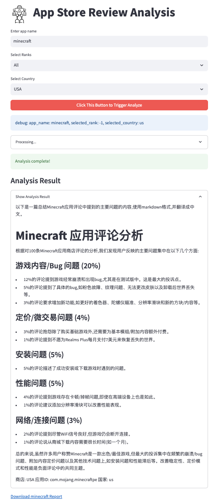

# Lite Version for CrewAI App Store Review workshop
lite version for crewai app store review workshop

## Getting Started

``` shell
git clone git@ssh.gitlab.aws.dev:wsuam/appstore-review-llm
cd lite_workshop
python3.10 -m venv .venv
source .venv/bin/activate
pip install --upgrade pip
pip install -r requirements.txt

mkdir output

streamlit run main_workshop.py
```




## License

This project is licensed under the [MIT License](../LICENSE).

## Acknowledgments

We would like to express our gratitude to the open-source community and the developers of the LLM services used in this project.